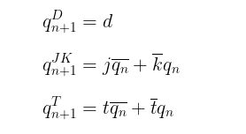

# Digital-electronics-1
https://github.com/xsobon02/Digital-electronics-1
## 1. Preparation tasks
### Characteristic equations and completed tables for D, JK, T flip-flops

| **d** | **q(n)** | **q(n+1)** | **Comments** |
| :-: | :-: | :-: | :-- |
| 0 | 0 | 0 | No change |
| 0 | 1 | 0 | Change |
| 1 | 1 | 1 | No change |
| 1 | 0 | 1 | Change |

| **j** | **k** | **q(n)** | **q(n+1)** | **Comments** |
| :-: | :-: | :-: | :-: | :-- |
| 0 | 0 | 0 | 0 | No change |
| 0 | 0 | 1 | 1 | No change |
| 0 | 1 | 0 | 0 | Reset |
| 0 | 1 | 1 | 0 | Reset |
| 1 | 0 | 0 | 1 | Set |
| 1 | 0 | 1 | 1 | Set |
| 1 | 1 | 0 | 1 | Toggle |
| 1 | 1 | 1 | 0 | Toggle |

| **t** | **q(n)** | **q(n+1)** | **Comments** |
| :-: | :-: | :-: | :-- |
| 0 | 0 | 0 | No change |
| 0 | 1 | 1 | No change |
| 1 | 0 | 1 | Toggle |
| 1 | 1 | 0 | Toggle |

## 2. D latch
### VHDL code listing of the process `p_d_latch`
```vhdl
p_d_latch : process (d, arst, en)

begin
    if (arst = '1') then
        q     <= '0';
        q_bar <= '1';
        
    elsif (en = '1') then
        q     <= d;
        q_bar <= not d;    
    end if;

end process p_d_latch;
```
### Listing of VHDL reset and stimulus processes from the testbench `tb_d_latch.vhd` file
```vhdl
  -- reset generation process
  p_reset_gen: process
  begin
        s_arst <= '0';
        wait for 28 ns;
        -- reset activated
        s_arst <= '1';
        wait for 53ns;
        -- reset deactivated
        s_arst <= '0';
        wait for 660ns;
        s_arst <= '1';
        wait;
  end process p_reset_gen;

  -- data generation process
  p_stimulus : process
    begin
        report "Stimulus process started" severity note;
        s_en    <= '0';
        s_d     <= '0';

        wait for 10 ns;
        s_d <= '1';
        wait for 10 ns;
        s_d <= '0';
        wait for 10 ns;
        s_d <= '1';
        wait for 10 ns;
        s_d <= '0';
        wait for 10 ns;
        s_d <= '1';
        wait for 10 ns;
        s_d <= '0';

        s_en <= '1'; wait for 5 ns;
        assert(s_q = '0' and s_q_bar = '1')
        report "expected: s_q 0, q_bar 1" severity error;
        
        s_d <= '1';
        wait for 10 ns;
        s_d <= '0';
        wait for 10 ns;
        s_d <= '0';
        wait for 10 ns;
        s_d <= '0';
        wait for 10 ns;
        s_d <= '1';
        wait for 10 ns;
        s_d <= '1';
        wait for 10 ns;
        s_d <= '1';
        
        s_en <= '0'; wait for 5 ns;
        assert(s_q = '1' and s_q_bar = '0') 
        report "expected: asrt 1" severity error;
        
        wait for 10 ns;
        s_d <= '1';
        wait for 10 ns;
        s_d <= '0';
        wait for 10 ns;
        s_d <= '1';
        wait for 10 ns;
        s_d <= '0';
        wait for 10 ns;
        s_d <= '1';
        wait for 10 ns;
        s_d <= '0';
        wait for 10 ns;
        s_d <= '0';      
        
        s_en <= '1'; wait for 5 ns;
        assert(s_q = '0' and s_q_bar = '1') 
        report "expected: asrt 1" severity error;
     
        report "Stimulus process finished" severity note;
        
        wait;

    end process p_stimulus;
```
### Screenshot with simulated time waveforms


## 3. Flip-flops
### VHDL code listing of the processes `p_d_ff_arst`
```vhdl
    p_d_ff_arst : process (clk, arst)

    begin                                                              
        if (arst = '1') then                                        
            q     <= '0';                                                  
            q_bar <= '1';                                              
        elsif rising_edge(clk) then                                          
            q     <= d;                                                    
            q_bar <= not d;                                            
        end if;
                                                        
    end process p_d_ff_arst; 
```
### Listing of VHDL clock, reset and stimulus processes from the testbench files
```vhdl
    -- clock
    p_clk_gen : process

    begin
        while now < 750 ns loop         
            s_clk_100MHz <= '0';
            wait for c_CLK_100MHZ_PERIOD / 2;
            s_clk_100MHz <= '1';
            wait for c_CLK_100MHZ_PERIOD / 2;
        end loop;
        wait;
                           
    end process p_clk_gen;
    
    -- reset
    p_reset_gen : process 

    begin
        s_arst <= '0';
        wait for 28 ns;
        s_arst <= '1';
        wait for 13 ns;
        s_arst <= '0';                
        wait;

    end process p_reset_gen;
    
    -- stimulus
    p_stimulus : process

    begin
        report "Stimulus process started" severity note;
        
        s_d <= '1';
        wait for 10ns;
        assert (s_q = '0' and s_q_bar = '1')
        report "Error" severity note;
        
        s_d <= '0';
        wait for 10ns;
        assert (s_q = '0' and s_q_bar = '1')
        report "Error" severity note;
        
        s_d <= '1';
        wait for 10ns;
        assert (s_q = '1' and s_q_bar = '0')
        report "Error" severity note;
       
        s_d <= '0';
        wait for 10ns;
        assert (s_q = '0' and s_q_bar = '1')
        report "Error" severity note;
        
        wait for 20ns;
        s_d <= '1';
        wait for 10ns;
        assert (s_q = '0' and s_q_bar = '1')
        report "Error" severity note;
 
        report "Stimulus process finished" severity note;
                
        wait;

    end process p_stimulus;
```
### Screenshot with simulated time waveforms


### VHDL code listing of the processes `p_d_ff_rst`
```vhdl
    p_d_ff_rst : process (clk)

    begin                                                              
        if rising_edge(clk) then
            if (rst = '1') then
                q       <= '0';
                q_bar   <= '1';
            else
                q       <= d;
                q_bar   <= not d;
            end if;
        end if; 
                                                    
    end process p_d_ff_rst;
```
### Listing of VHDL clock, reset and stimulus processes from the testbench files
```vhdl
    -- clock
    p_clk_gen : process

    begin
        while now < 750 ns loop         
            s_clk_100MHz <= '0';
            wait for c_CLK_100MHZ_PERIOD / 2;
            s_clk_100MHz <= '1';
            wait for c_CLK_100MHZ_PERIOD / 2;
        end loop;
        wait;
                           
    end process p_clk_gen;
    
    -- reset
    p_reset_gen : process 

    begin
        s_rst <= '0';
        wait for 28 ns;
        s_rst <= '1';
        wait for 13 ns;
        s_rst <= '0';                
        wait;

    end process p_reset_gen;
    
    -- stimulus
    p_stimulus : process

    begin
        report "Stimulus process started" severity note;
        
        s_d <= '1';
        wait for 10ns;
        assert (s_q = '1' and s_q_bar = '0')
        report "Error" severity note;
        
        s_d <= '0';
        wait for 10ns;
        assert (s_q = '0' and s_q_bar = '1')
        report "Error" severity note;
        
        s_d <= '1';
        wait for 10ns;
        assert (s_q = '0' and s_q_bar = '1')
        report "Error" severity note;
       
        s_d <= '0';
        wait for 10ns;
        assert (s_q = '0' and s_q_bar = '1')
        report "Error" severity note;
        
        wait for 20ns;
        s_d <= '1';
        wait for 10ns;
        assert (s_q = '1' and s_q_bar = '0')
        report "Error" severity note;
 
        report "Stimulus process finished" severity note;
                
        wait;

    end process p_stimulus;
```
### Screenshot with simulated time waveforms


### VHDL code listing of the processes `p_jk_ff_rst`
```vhdl
    p_jk_ff_rst : process (clk)

    begin                                                              
        if rising_edge(clk) then
            if (rst = '1') then
              s_q     <= '0';
              s_q_bar <= '1';
            else
            if (j = '0' and k = '0') then
                s_q     <= s_q;
                s_q_bar <= s_q_bar;
            elsif (j = '0' and k = '1') then
                s_q     <= '0';
                s_q_bar <= '1';
            elsif (j = '1' and k = '0') then
                s_q     <= '1';
                s_q_bar <= '0';
            else
                s_q     <= not s_q;
                s_q_bar <= not s_q_bar;
            end if;       
          end if;  
        end if;
                                                     
    end process p_jk_ff_rst;
```
### Listing of VHDL clock, reset and stimulus processes from the testbench files
```vhdl
    -- clock
    p_clk_gen : process

    begin
        while now < 750 ns loop         
            s_clk_100MHz <= '0';
            wait for c_CLK_100MHZ_PERIOD / 2;
            s_clk_100MHz <= '1';
            wait for c_CLK_100MHZ_PERIOD / 2;
        end loop;
        wait;
                           
    end process p_clk_gen;
    
    -- reset
    p_reset_gen : process 

    begin
        s_rst <= '0';
        wait for 28 ns;
        s_rst <= '1';
        wait for 13 ns;
        s_rst <= '0';                
        wait;

    end process p_reset_gen;
    
    -- stimulus
    p_stimulus : process

    begin
        report "Stimulus process started" severity note;
        
        s_j <= '1';
        s_k <= '0';
        wait for 10ns;
        assert (s_q = '1' and s_q_bar = '0')
        report "Error" severity note;
        
        s_j <= '0';
        s_k <= '1';
        wait for 10ns;
        assert (s_q = '0' and s_q_bar = '1')
        report "Error" severity note;
        
        s_j <= '1';
        s_k <= '0';
        wait for 10ns;
        assert (s_q = '1' and s_q_bar = '0')
        report "Error" severity note;
       
        s_j <= '0';
        s_k <= '1';
        wait for 10ns;
        assert (s_q = '0' and s_q_bar = '1')
        report "Error" severity note;  
        
        s_j <= '1';
        s_k <= '1';
        wait for 10ns;
        assert (s_q = '1' and s_q_bar = '0')
        report "Error" severity note;
        
        s_j <= '1';
        s_k <= '1';
        wait for 10ns;
        assert (s_q = '0' and s_q_bar = '1')
        report "Error" severity note;
        
        s_j <= '1';
        s_k <= '1';
        wait for 10ns;
        assert (s_q = '1' and s_q_bar = '0')
        report "Error" severity note;
        
        s_j <= '0';
        s_k <= '0';
        wait for 10ns;
        assert (s_q = '1' and s_q_bar = '0')
        report "Error" severity note;
 
        report "Stimulus process finished" severity note;
                
        wait;

    end process p_stimulus;
```
### Screenshot with simulated time waveforms


### VHDL code listing of the processes `p_t_ff_rst`
```vhdl
    t_ff_rst : process(clk)

    begin
        if rising_edge(clk) then
            if (rst = '1') then
                s_q     <=  '0';
                s_q_bar <=  '1'; 
             else
                if (t = '0') then
                    s_q     <=  s_q;
                    s_q_bar <=  s_q_bar;
                else
                    s_q     <=  not s_q;
                    s_q_bar <=  not s_q_bar;
                end if;
             end if;
        end if;

    end process t_ff_rst;
```
### Listing of VHDL clock, reset and stimulus processes from the testbench files
```vhdl
    -- clock
    p_clk_gen : process

    begin
        while now < 750 ns loop         
            s_clk_100MHz <= '0';
            wait for c_CLK_100MHZ_PERIOD / 2;
            s_clk_100MHz <= '1';
            wait for c_CLK_100MHZ_PERIOD / 2;
        end loop;
        wait;  
                         
    end process p_clk_gen;
    
    -- reset
    p_reset_gen : process 

    begin
        s_rst <= '0';
        wait for 28 ns;
        s_rst <= '1';
        wait for 13 ns;
        s_rst <= '0';                
        wait;

    end process p_reset_gen;
    
    -- stimulus
    p_stimulus : process

    begin
        report "Stimulus process started" severity note;
        
        wait for 20ns;
        s_t <= '1';
        wait for 10ns;
        assert (s_q = '1' and s_q_bar = '0')
        report "Error" severity note;
        
        s_t <= '0';
        wait for 10ns;
        assert (s_q = '1' and s_q_bar = '0')
        report "Error" severity note;
        
        s_t <= '1';
        wait for 10ns;
        assert (s_q = '0' and s_q_bar = '1')
        report "Error" severity note;
        
        s_t <= '0';
        wait for 10ns;
        assert (s_q = '0' and s_q_bar = '1')
        report "Error" severity note;
        
        s_t <= '1';
        wait for 10ns;
        assert (s_q = '1' and s_q_bar = '0')
        report "Error" severity note;
        
        s_t <= '0';
        wait for 10ns;
        assert (s_q = '1' and s_q_bar = '0')
        report "Error" severity note;
 
        report "Stimulus process finished" severity note;
                
        wait;

    end process p_stimulus;
```
### Screenshot with simulated time waveforms


## 4. Shift register
### Image of the shift register schematic